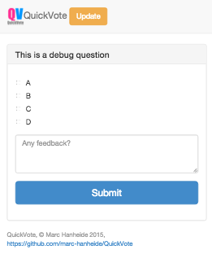
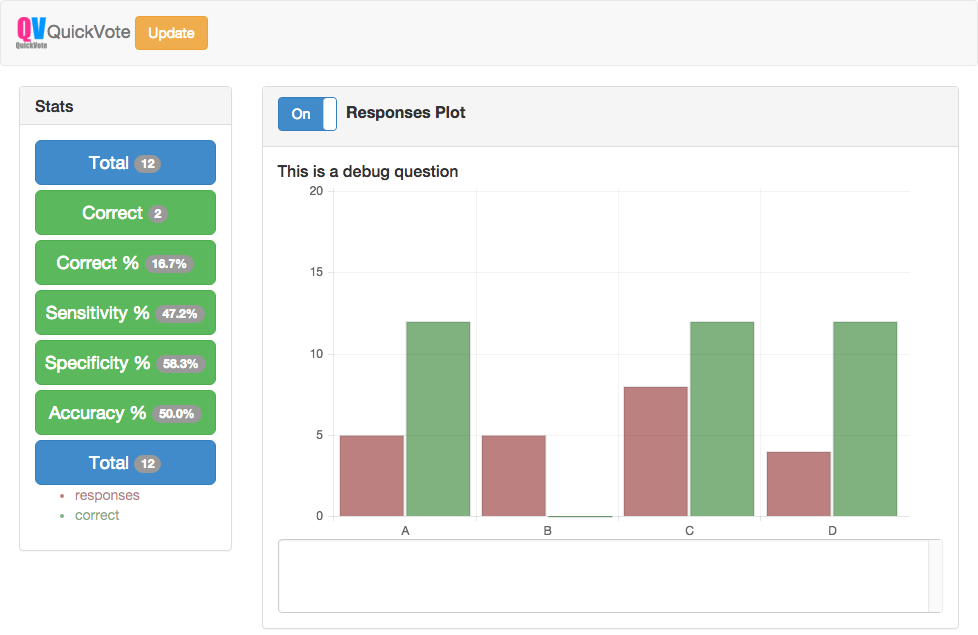

# QuickVote


QuickVote is a simply voting web application designed for extreme simplicity, mobile use, responsiveness, and ease of use. Using a mongodb backend and bootstrap. Particularly designed to facilitate in-class quizzes, e.g. to support [ConceptTest](http://serc.carleton.edu/introgeo/interactive/conctest.html) of [Peer Instruction](https://en.wikipedia.org/wiki/Peer_instruction).

# Installation

## Requirements

* Python 2.7 with following extra packages
  * [web.py](http://webpy.org/)
  * [pymongo](https://api.mongodb.org/python/current/)
  * [httpagentparser](https://pypi.python.org/pypi/httpagentparser)
* [MongoDB](https://www.mongodb.org/) (could run on localhost, as in default config, or on another machine)

## Installation
* install dependencies, e.g. `sudo pip install web.py pymongo httpagentparser`
* clone from github: `git clone https://github.com/marc-hanheide/QuickVote.git`

## Configuration
* change values in `config.py`

## Running
* `python app.py`

### Running behind Apache Proxy

Here is a working example of a configuration to run behind an Apache Reverse Proxy:

```
<Location /qv>
   ProxyHTMLEnable     On
   ProxyPass            http://localhost:8212/qv disablereuse=On
   ProxyPassReverse     http://localhost:8212/qv
   ProxyHTMLExtended On


   SetOutputFilter INFLATE;proxy-html;DEFLATE;
   ProxyHTMLURLMap /static /qv/static
</Location>

<Location /qv/static>
   ProxyPass            http://localhost:8212/static/ disablereuse=On
   ProxyPassReverse     http://localhost:8212/static/
</Location>
```

# Usage

In the following, we assume QuickVote is running on your localhost at port 8212. Change the examples below to match you local configuration

## Setup a domain

QuickVote has support for multiple domains (e.g. different lectures). Each domain currently needs to be configured manually in the `domains` collection on the `QuickVote` mongo database. A debug domain is automatically create on first start-up, similar to this:

```
{
    "admin_url" : "cc32d639-4489-e51b-b7dd-c4209c97af40",
    "name" : "debug",
    "inserted_at" : ISODate("2015-10-09T10:01:49.312Z")
}
```

Another document with a similar structure can be manually inserted into the collection to create new domains. The `admin_url` could be anything, but this is the only secret you've got that is stopping people from unauthorised question editing, so make sure it's something reasonably unguessable. It's like the password for quickvote that you use to authenticate.

## Logging in

In order to edit questions and view results users need to be logged in.

With a domain generated (and the `admin_url` remembered), you can log in from your browser by entering the following a URL following this pattern:

`http://localhost:8212/qv/$domain/$admin_url/login`

with `$domain` and `$admin_url` replaced with your values. So in our example, it would be

http://localhost:8212/qv/debug/cc32d639-4489-e51b-b7dd-c4209c97af40/login

After this you are logged in in this browser via an authentication cookie until the browser session ends. You can go to http://localhost:8212/qv/debug/cc32d639-4489-e51b-b7dd-c4209c97af40/logout to log out explicitly.

## Editing and Selecting Questions

After logging in, goto http://localhost:8212/qv/debug/editor (replace `debug` by your domain, obviously)


A simple editor is presented allowing to edit questions. Pick a question form the left-hand drop-down. All questions ever generated for a given domain are stored in the database and are listed in the drop-down menu, with the most recent one on top. Picking a question in the menu will do two things:

1. You can now edit the Questions (and the options)
2. more importantly, you *select* the *active* question that is presented to all clients of that domain, e.g. all participants that point their device to http://localhost:8212/qv/debug/ will be asked the question currently selected. So, you want to keep this window open to always be able to choose the question you want to ask

Currently, you can delete a question by clearing the "Question" field and submitting it (a bit awkward, yes, should be changed). 

Clicking "Delete All Answers" will delete all responses from your participants to the active question.

## Participants interface

After you selected a question, ask your participants to go to http://localhost:8212/qv/debug/ *(note that they cannot access the editor or view results, as they are not logged in, They will see a "not allowed" error if they try)*. 



Here, participants can select all options to answer a given question and submit their answer. 
Each question can only be answered once by each participant (facilitate by a session cookie). If you want to ask the same question again to your participants, select it again in the editor, which will clear all cookies and allow participants to submit new answers.

## Viewing Results

Again, only user logged in can see results. Go to http://localhost:8212/qv/debug/view to see results like this:



The view is fully responsive to new submissions coming in and is updated on the fly. So you can see the number of submission increasing as participants cast their vote.

The histogram, showing the correct answers as a green bar chart, is initially not shown, to prevent participants from seeing the correct answer before the have finished submitting. You can decide to display the result when enough submissions have arrived, or when a discussion was had.


*Author: Marc Hanheide (Copyright 2015)*
